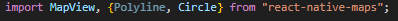
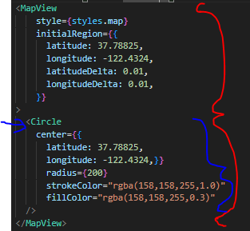

# CaptuAR

First, clone the repo:
git clone ...

To install all the necessary libraries, type:
npm install

The libraries are copied from the starter app with the exception of the react-native-maps library.

Which contains components like Circle and Polyline if you would like to draw custom shapes.
For more on that visit: https://github.com/react-native-maps/react-native-maps

Then to start the app type:
npm start
OR
npx expo start --tunnel

Once the app has finished bundling you should see a purple circle in San Francisco.
Zoom out if you want a more detailed look.

The circle is drawn on top of your starting position but that can be easily changed by modifying the coordinates under Circle.
Note that the Circle component is under the MapView component like how all the elements of a list are under a list component.

Mess with the Circle props if you want or even try to draw your own shapes!